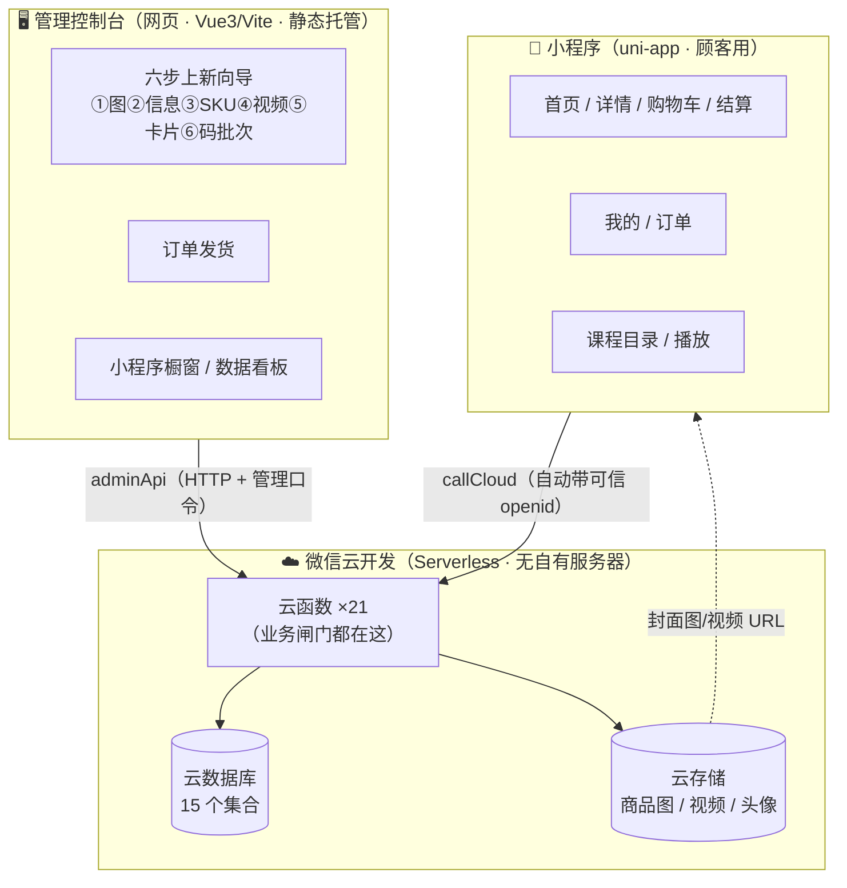
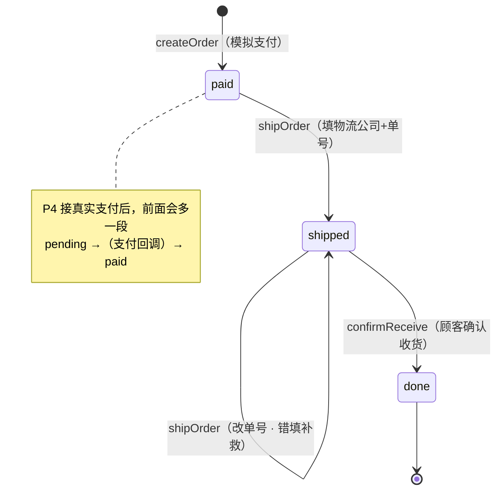
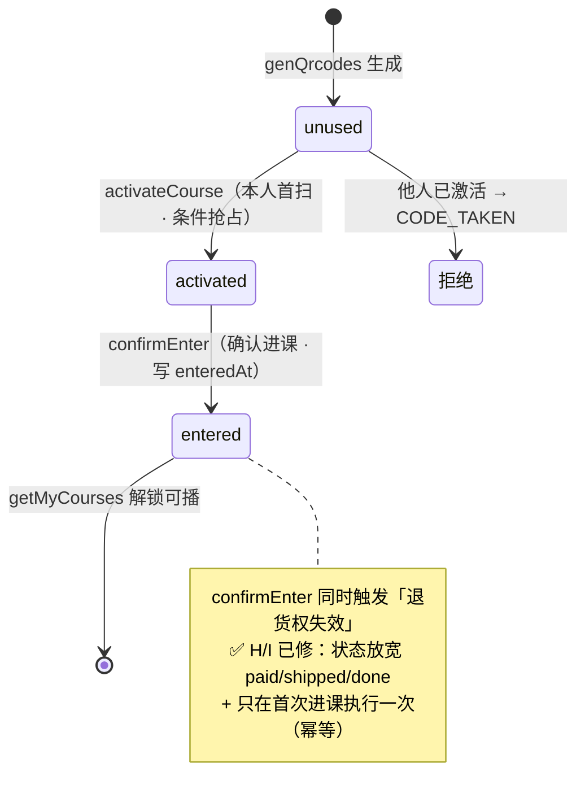

# 业务逻辑架构与主要逻辑链

> 更新日期：2026-06-11
> 用途：把整个系统「怎么跑起来」一张图说清——三层架构、数据存哪、每条业务链的触发→步骤→闸门→状态变化。
> **代码按技术分层组织（pages/store/api/cloudfunctions…），本文档是按业务链的「整体视图」地图**——一条链的代码物理上分布在多文件多目录（受云函数独立部署等硬约束，见 关键决策记录 §17），这里把它们汇成一处叙述。
> 配套：目标设计见 `设计规格-课程电商系统.md`；当前完成度见 `项目现状.md`；安全/逻辑缺口见 `审核报告-定向-202606.md` + `调试日志.md`。
> 图用 Mermaid（GitHub / 多数 Markdown 查看器可渲染）。

---

## 一、系统架构总览（三层）

**三层各管什么**
- **管理控制台**：店主操作台。上新商品、编排课程视频、设计二维码卡片、生成激活码、发货、看经营数据。改的是「内容和经营动作」。
- **微信云开发（后端）**：没有自己的服务器。**云函数**是所有敏感操作的唯一入口（身份、定价、状态流转都在这把关）；**云数据库**存业务数据；**云存储**存图片视频。
- **小程序**：顾客端。浏览、下单、收货、扫码激活、看课、评价。**不信任前端**——价格、状态、权限一律由云函数按云端数据裁决。

**两条进云的通道**
- 顾客端 → `callCloud` → 云函数：微信自动附上**可信的 openid**（身份），前端伪造不了。
- 管理台 → `adminApi`（HTTP 服务）→ 云函数：用**管理口令**（sha256 校验）鉴权。

---

## 二、数据集合地图（云数据库 15 个集合）

| 集合 | 存什么 | 写入口（云函数） |
|---|---|---|
| `users` | 用户档案（openid/昵称/头像） | login / updateProfile |
| `products` | 已上架商品（首页/详情读这个） | adminApi.publishProduct |
| `productsDraft` | 商品上新草稿（未发布） | adminApi.saveDraft |
| `courses` | 已发布课程（三层：章/课时/段+视频） | adminApi.publishCourse / seedCourses |
| `coursesDraft` | 课程编排草稿 | adminApi.saveCourseDraft |
| `orders` | 订单（条目快照/金额/地址/状态） | createOrder / shipOrder / confirmReceive / confirmEnter |
| `qrcodes` | 激活码（一码一档，含批次/状态） | genQrcodes / activateCourse |
| `activations` | 激活记录（谁激活了哪门课/是否进课） | activateCourse / confirmEnter |
| `reviews` | 商品评价 | submitReview |
| `events` | 通用埋点流水 | trackEvent |
| `progress` | 学习进度（每人每课一条折叠） | trackEvent |
| `content` | 首页可编辑内容（文案/信任条/FAQ） | adminApi.saveHomeContent |
| `cards` | 二维码卡片设计稿 | adminApi.saveCard |
| `adminConfig` | 管理口令 / 网址前缀设置 | adminApi |
| `uploadChunks` | 大图/视频分片中转（临时） | adminApi.uploadChunk |

> 原则：**敏感写一律走云函数**，前提是「顾客手机不能直接写库」（客户端权限须为仅创建者可读写，见验收单 X）。

---

## 三、主要业务逻辑链（9 条）

> 每条标注：**触发 → 步骤 → 闸门（拦什么）→ 状态/数据变化 → 涉及云函数**。

### 链 1 · 登录与身份
- **触发**：小程序启动。
- **步骤**：`login` 取微信可信 openid → `users` 里 upsert（有则返回、无则建档）。
- **闸门**：openid 来自微信、前端伪造不了；之后**所有敏感操作的身份都以它为根**。
- **云函数**：login（首登）；后续每次操作云函数自取 `getWXContext().OPENID`。

### 链 2 · 商品上架（控制台 → 小程序可见）
- **触发**：店主在控制台走上新向导。
- **步骤**：①传图②填信息③配 SKU → 存 `productsDraft`（草稿，顾客看不到）→ 点「上架小程序」→ `publishProduct` → 写 `products` → 小程序 `getProducts` 即刻可见。
- **闸门**：`publishProduct` 校验**封面图 / 名称价格 / 至少一个规格**齐全（NEED_COVER / NEED_INFO / NEED_SKUS），缺一不可发布。
- **⚠️ 已知缺口（链2）**：**只有上架、没有下架/删除**。`publishProduct` 写入 `products` 后该商品**永久可售**——`deleteDraft` 只删草稿、橱窗 featured=false 只是不上首页轮播、`getProducts` 仍全量下发。持续上新的店要停售某款时无路径（误发布也撤不回）。见 `技术债与重构.md` #12。
- **云函数**：adminApi.saveDraft → adminApi.publishProduct → getProducts。

### 链 3 · 课程内容（编排 → 发布 → 学员观看）
- **触发**：店主在控制台第④步编排课程。
- **步骤**：三层树编辑（章/课时/段）+ 视频直传云存储拿 fileID → 存 `coursesDraft` → 点「发布更新」→ `publishCourse` 整体覆盖 `courses` → 学员 `getCourses` 可见、播放页按段播真实视频。
- **闸门**：码批次必须指向**已发布课程**（防废码，见链 6）；视频直传失败自动回落分片通道。
- **⚠️ 已知缺口**：视频「未激活看不了」目前是**界面锁**，真实内容鉴权未上（设计规格 §四标注待办）。
- **云函数**：adminApi.saveCourseDraft → adminApi.publishCourse → getCourses。

### 链 4 · 下单（详情 → 购物车 → 结算 → 订单）
- **触发**：顾客在详情页选规格、加购或立即购买。
- **步骤**：详情选 SKU → 购物车（按 **id+规格 双键**，同款不同规格算两条）→ 结算 → `createOrder` → 写 `orders`（模拟支付，直接 `status='paid'`）→ 支付成功页 → 订单详情**同一笔**。
- **闸门**：openid 必须有；条目契约（id 非空、数量正整数）；**价格一律按云端 `products` 现算**（前端传的价被忽略）；带规格则必须在云端 SKU 命中（否则 UNKNOWN_SKU 整单拒）；地址只收白名单字段。
- **云函数**：createOrder → getMyOrders / 订单详情读同一笔。
- **占位说明**：优惠券 ¥20 + 运费 0 为**开发期占位**（无条件抵扣每一单，无券归属/资格）——用户 2026-06-11 确认是占位、非缺陷；P4 做真实券系统时替换。
- **未来（P4）**：接真实微信支付后，拆为 `pending →（支付回调）→ paid`。

### 链 5 · 履约（发货 → 收货 → 完成）—— 见状态机 ①
- **触发**：付款后店主发货。
- **步骤**：控制台「订单发货」填物流 → `shipOrder`（写物流快照，paid→shipped）→ 小程序订单显示物流卡 → 顾客「确认收货」→ `confirmReceive`（shipped→done）。
- **闸门**：`shipOrder` 只允许 **待发货/已发货**（已完成不能再发）；`confirmReceive` **只允许已发货**（不能跳过发货直接完成、不能重复确认）。
- **云函数**：adminApi.shipOrder → confirmReceive。

### 链 6 · 二维码激活（生成 → 封码 → 扫码 → 进课 → 失退货权）—— 见状态机 ②
- **触发**：店主生成激活码并封进产品包装。
- **步骤**：
  1. 控制台第⑥步生成批次 → `genQrcodes` → 写 `qrcodes`（`status='unused'`）+ 导出印刷包。
  2. 备货时每个产品包装封入一码（**码不绑订单**，2026-06-10 决策：备货时不知盒内是哪笔单）。
  3. 顾客收货扫码 → `activateCourse`（**一码一用**：`unused→activated` 条件抢占）→ 建 `activations` 行（`enteredAt=null`）。
  4. 两页式欢迎页确认 → `confirmEnter`（写 `enteredAt` = 进课唯一闸 + **触发退货权失效**）。
  5. 之后 `getMyCourses` 只返回**已确认（enteredAt 非空）**的课 → 目录解锁、可播放。
- **闸门**：`activateCourse` 一码一用（他人扫已用码 → CODE_TAKEN）；`genQrcodes` 管理通道判定 + 防废码（课程不存在 → UNKNOWN_COURSE）+ 码全局唯一；`getMyCourses` 是**进课唯一闸**（没确认就锁着）。
- **退货权失效（confirmEnter）**：✅ 2026-06-11 修复两处——订单状态放宽 paid/shipped/done（H，收货后进课也失效）+ 失效块移进「首次进课」守卫只执行一次（I，重复确认不多扣）。课程→多产品共享 courseId 时仍按「最早一条可退条目」反查（规格软化，验收扫码兜底）。待 P4 真实退款复验。
- **云函数**：genQrcodes → activateCourse → confirmEnter → getMyCourses。

### 链 7 · 学习进度（埋点 → 折叠 → 看板）
- **触发**：顾客看视频（段末/播完/离开播放页）。
- **步骤**：`trackEvent` 一次两用——写 `events` 流水（运营分析）+ 折叠进 `progress`（每人每课一条：`done{段}` / `last{位置}`）→ `getMyProgress` 喂目录角标和「继续学习」卡 → 看板 `getDashboard` 聚合出热点/卡点。
- **闸门**：openid 限定本人；`meta` ≤1KB。
- **⚠️ 小缺口**：不校验课程访问权——可给没买的课伪造进度（污染看板，不解锁内容），见审核报告 A-3 思路。
- **云函数**：trackEvent → getMyProgress / getDashboard。

### 链 8 · 评价（已完成订单 → 评价 → 详情展示）
- **触发**：顾客在「已完成」订单点「评价晒单」。
- **步骤**：带订单 id 进评价页 → `submitReview` → 写 `reviews` → 详情页/全部评价页 `getReviews` 读汇总+列表。
- **闸门**：必须是**本人**的**已完成**订单、且**商品在该订单内**；**一单一品一评**（库级唯一约束，重复 → REVIEWED）；昵称取云端快照（可匿名）。
- **云函数**：submitReview → getReviews。

### 链 9 · 首页内容运营（橱窗）
- **触发**：店主在控制台「小程序橱窗」编辑。
- **步骤**：排序/上下架（`saveShowcase` 改 `products.sort/featured`）+ 首页文案/信任条/FAQ（`saveHomeContent` 写 `content`）→ 小程序 `getProducts`/`getContent` 重开生效。
- **闸门**：空块回退本地默认（防误清空线上）。
- **云函数**：adminApi.saveShowcase / saveHomeContent → getProducts / getContent。

---

## 四、关键状态机

### ① 订单状态机

- **守的规则**：不能跳级（paid 不能直接 done）、不能倒退、不能重复确认。`shipOrder` 只收 paid/shipped；`confirmReceive` 只收 shipped。

### ② 激活码 / 进课状态机

- **守的规则**：一个码只能被一个账号激活（`unused→activated` 用条件更新抢占，谁先改到谁赢）；**确认进课（enteredAt）是看课的唯一闸**，光激活没确认仍看不了。

---

## 五、安全闸门一览（哪些操作有什么前置约束）

| 操作 | 前置闸门 | 拒绝信号 |
|---|---|---|
| 任何敏感云函数 | 必须有可信 openid | NO_OPENID |
| 下单 createOrder | 价格按云端、规格须命中、条目契约 | UNKNOWN_SKU / UNKNOWN_ITEM / EMPTY_ITEMS |
| 发货 shipOrder | 仅 paid/shipped | BAD_STATUS |
| 确认收货 confirmReceive | 仅本人 shipped 订单 | NOT_FOUND / BAD_STATUS |
| 激活 activateCourse | 一码一用 | CODE_TAKEN / INVALID_CODE |
| 进课 confirmEnter | 须先激活 | NOT_ACTIVATED |
| 评价 submitReview | 本人/已完成/商品在单/一单一评 | NOT_DONE / NOT_IN_ORDER / REVIEWED |
| 生成码 genQrcodes | 管理通道或 isAdmin、课程须存在 | ADMIN_ONLY / UNKNOWN_COURSE |
| 灌种子 seed*/initDb | 管理通道或 isAdmin | ADMIN_ONLY |
| 控制台所有写 adminApi | 管理口令（sha256） | BAD_KEY |

> 这些闸门已有自动化测试守护（`tests/cloud/`，37 例），删一个闸对应用例会变红。

---

## 六、已知逻辑缺口（链接）

> 2026-06-11 基于本文档做了一轮逐链再审核（成果见工作日志同日条目）。下表汇总。

| 编号 | 缺口 | 严重度 | 去向 |
|---|---|---|---|
| 调试日志 **H** | 退货权失效只认 paid 订单，真实流程（收货后才扫码确认）几乎不触发 | P2 | ✅ 已修（2026-06-11，状态放宽 paid/shipped/done）；待 P4 退款复验 |
| 调试日志 **I** | 退货权失效未限定「首次进课」，重复调用 confirmEnter 会多扣（服务端不幂等） | P3 | ✅ 已修（2026-06-11，失效块移进首次进课守卫）；待 P4 退款复验 |
| 再审核 **链2** | 已上架商品**无下架/删除路径**——publishProduct 写入后永久可售，deleteDraft 只删草稿、getProducts 全量下发 | P2 | 技术债 #12 |
| 再审核 **链4** | 优惠券 ¥20 无条件抵扣每一单 | **非缺陷·开发期占位** | 用户确认（2026-06-11）；P4 做真实券系统时替换 |
| 再审核 **链6** | 课程→多产品共享 courseId（如 prod-1/prod-4 同 course-duck），退货权反查可能翻到另一产品的订单（叠加 H/I；规格「验收扫码兜底」软化） | P3 | 随 H 一并修 |
| 审核报告 §链3 | 视频内容无服务端播放鉴权（仅界面锁） | 中 | 内容保护里程碑 |
| 审核报告 A-3 | trackEvent 进度可伪造（污染看板） | P3 | 技术债 |

> 维护约定：业务链或状态机变化时**先改本文件再动代码**；新缺口记 `调试日志.md`，对账进本文件第六节。
